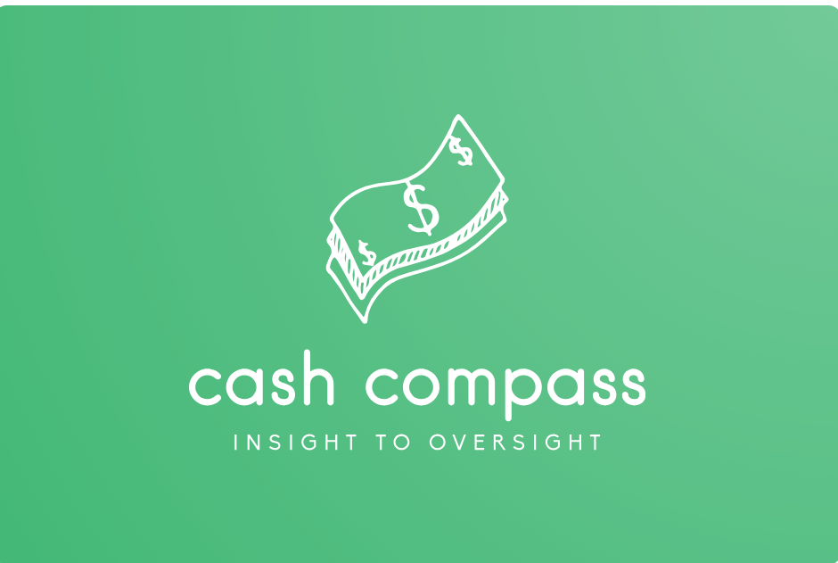

# Cash Compass Dash App v 1.0



## Overview

The **Cash Compass Dash App** is a financial dashboard designed to visualize spending data and adjusted spending based on Consumer Price Index (CPI) data fetched from the FRED API. The app features a user-friendly interface that allows filtering by category or month and predicts future expenses using machine learning.

## Features

- **CPI Data Fetching**: Automatically retrieves CPI data from the FRED API.
- **Spending Data Visualization**: Visualizes spending data across different categories.
- **Adjusted Spending**: Adjusts spending data based on CPI changes.
- **Expense Prediction**: Uses machine learning to predict expenses for the next month.
- **Interactive Filters**: Filter data by category or month for detailed analysis.
- **Cumulative Graphs**: Displays cumulative expenses and adjusted cumulative expenses for a comprehensive view.

## Prerequisites

Before running the project, ensure you have the following installed:

- [Python 3.8+](https://www.python.org/downloads/)
- [pip](https://pip.pypa.io/en/stable/installation/)

## Installation

1. **Clone the repository**:
    ```bash
    git clone https://github.com/your-username/cash-compass-dash-app.git
    cd cash-compass-dash-app
    ```

2. **Create and activate a virtual environment** (optional but recommended):
    ```bash
    python -m venv venv
    source venv/bin/activate  # On Windows: venv\Scripts\activate
    ```

3. **Install the required Python packages**:
    ```bash
    pip install -r requirements.txt
    ```

4. **Set up the FRED API Key**:

   Get your API key from the [FRED website](https://fred.stlouisfed.org/) and add it to the `main()` function in the `cash-compass-v5.ipynb` file:
   ```python
   api_key = "your_api_key_here"
   ```

## Usage

Open your web browser and go to the provided Jupyter Notebook interface to run the cells in `cash-compass-v5.ipynb`.

### Interacting with the app:

- Use the dropdown menus to filter data by category or by month.
- View spending data and its adjustment based on CPI.
- Observe predictions for future spending.
- Explore cumulative graphs for a holistic view of your expenses over time.

## Results

The following screenshots provide a summary analysis of the application's output:

### Health Category Summary


This screenshot shows the detailed spending analysis for the Health category.

### July Summary


This screenshot provides an overview of spending for the month of July.

## Project Structure

- **cash-compass-v5.ipynb**: The main Jupyter Notebook file containing the Dash app code.
- **assets/**: Contains static assets like the Cash Compass logo.
  - `cash_compass.png`: The logo of the application.
- **Summary analysis/**: Contains screenshots of the analysis results.
  - `summary_health.png`: Health category spending summary.
  - `summary_july.png`: July spending summary.

## Acknowledgements

- [Plotly Dash](https://plotly.com/dash/) for the web application framework.
- [FRED API](https://fred.stlouisfed.org/) for providing CPI data.
- **ChatGPT** was used to assist in code debugging and inquiries about programming.

## Authors

- Josue St Louis
- Mario Penagos


